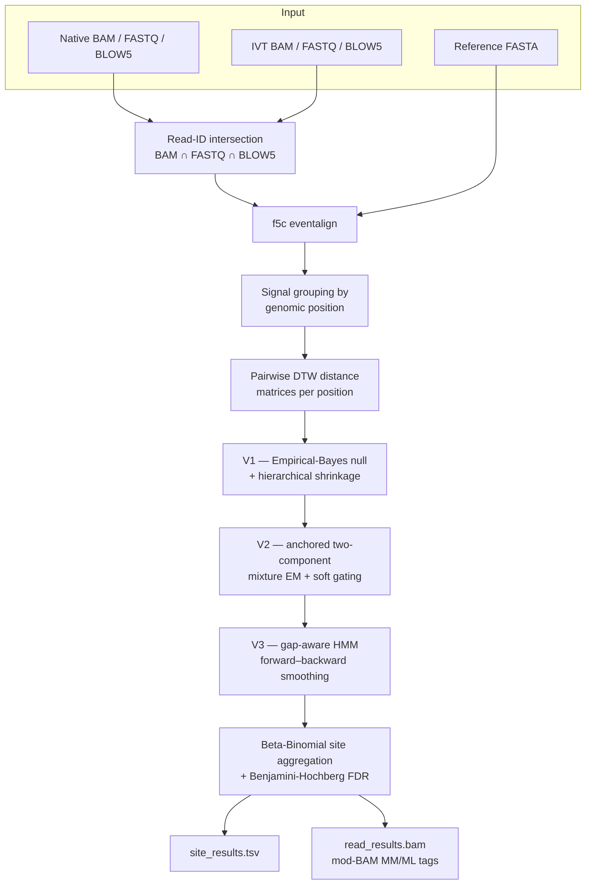

# Pipeline Overview

Baleen turns raw nanopore signal into per-site RNA modification calls by
contrasting a **native** sample against an **IVT** (in vitro transcribed,
unmodified) control. The core assumption: at an unmodified position the native
and IVT current signals are interchangeable; at a modified position the native
signal diverges from the IVT distribution.

## Stages

### 0. Read-ID intersection

Before any signal work, Baleen computes
`reads(BAM) ∩ reads(FASTQ) ∩ reads(BLOW5)` independently for each condition.
`f5c` silently drops BAM reads whose UUIDs are absent from the BLOW5 signal
file; without the intersection, depth statistics, subsampling, and the
`--min-depth` filter would all be computed against a read set larger than the
one that actually yields signals. Every downstream stage is gated on this
intersection. Disable with `--no-read-intersection`. See
[Inputs › Read-ID intersection](inputs.md#read-id-intersection).

### 1. Event alignment (`f5c eventalign`)

Each read's raw signal is aligned to its reference sequence, producing a table
that maps reference positions to segments of the current signal. Baleen invokes
the external `f5c` binary (RNA mode by default).

### 2. Signal grouping

Per-position signal segments are collected across reads and grouped by genomic
position. Only positions covered in **both** native and IVT are retained. The
`--padding` option concatenates flanking positions into each window to give DTW
more context.

### 3. Pairwise DTW

For every retained position, Baleen computes a **pairwise DTW distance matrix**
between native and IVT signal segments. DTW (Dynamic Time Warping) is robust to
the local time-warping inherent in nanopore translocation. The computation runs
on a [CUDA backend](performance.md#dtw-backend) when available, with an
automatic `tslearn` CPU fallback.

### 4. Three-stage hierarchical modification calling

The per-position distance structure is converted into per-read modification
probabilities through three nested models:

| Stage | Name | What it does |
|-------|------|--------------|
| **V1** | Empirical-Bayes null | Estimates the IVT-vs-IVT null distance distribution per position, with coverage-adaptive three-level shrinkage (position → local window → global) so low-coverage positions borrow strength from their neighbours. |
| **V2** | Anchored mixture EM | Fits a two-component (modified / unmodified) mixture to the native distances, anchored on the V1 null, using continuous **soft gating** rather than a hard binary threshold. |
| **V3** | Gap-aware HMM | A Hidden Markov Model runs forward–backward smoothing along each read's trajectory, sharing information between neighbouring positions and tolerating coverage gaps. Produces the final per-read `p_mod_hmm`. |

HMM parameters can be the built-in unsupervised defaults, or learned in
semi-supervised / supervised modes — see [HMM Training Modes](hmm-training.md).

### 5. Site aggregation

Per-read probabilities are aggregated to per-site calls:

- **mod_ratio** — MAP estimate of modification stoichiometry from a
  Beta-Binomial model, with a 95% credible interval (`ci_low`, `ci_high`).
- **p-value** — one-sided **Fisher's exact test** on the binary
  modified/unmodified calls (native vs IVT), thresholded at `--mod-threshold`.
- **padj** — Benjamini-Hochberg FDR correction across all tested sites.
- **effect_size**, **stoichiometry**, coverage counts.

See [Outputs](outputs.md) for the complete schema.

## Outputs

| File | Level | Description |
|------|-------|-------------|
| `site_results.tsv` | per-site | Modification calls with statistics. |
| `read_results.bam` | per-read | Standard mod-BAM with `MM`/`ML` tags. |

## Two ways to run

- **`baleen run`** — the full pipeline end to end.
- **`baleen aggregate`** — re-run HMM and/or site aggregation on previously
  saved results without recomputing DTW (the expensive step). Useful for
  sweeping `--mod-threshold` or applying trained HMM parameters.

Both are documented in the [CLI Reference](cli.md).
