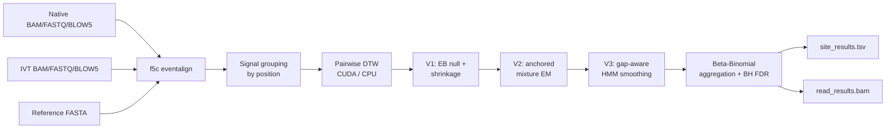

# Baleen

**Hierarchical Bayesian framework for RNA modification detection from nanopore direct RNA sequencing.**

Baleen detects RNA modifications by comparing ionic current signals between
**native** reads and an **IVT** (in vitro transcribed, unmodified) control.
It uses CUDA-accelerated Dynamic Time Warping (DTW) to quantify per-read
signal divergence, then a three-stage hierarchical model to call per-read and
per-site modification probabilities.

- :material-rocket-launch: **[Quick Start](quickstart.md)**

    Run the full pipeline on a native/IVT pair in one command.

- :material-download: **[Installation](installation.md)**

    Install from source (CUDA auto-detected) or pull a Docker image.

- :material-sitemap: **[Pipeline Overview](guide/overview.md)**

    How signals become per-site modification calls.

- :material-api: **[API Reference](api/index.md)**

    The public Python API, auto-generated from docstrings.

## Key features

- **CUDA-accelerated DTW** — a batched multi-position GPU kernel processes all
  positions of a contig in a single launch with concurrent CUDA streams.
  Automatic CPU fallback via `tslearn` when no GPU is available.
- **Three-stage hierarchical modification calling**
    - **V1** — robust IVT null estimation with coverage-adaptive three-level
      shrinkage (position → local window → global).
    - **V2** — anchored two-component mixture EM with continuous soft gating.
    - **V3** — gap-aware Hidden Markov Model with forward–backward smoothing
      along read trajectories.
- **Standard mod-BAM output** — per-read modification probabilities in
  `MM:Z` / `ML:B:C` tags, compatible with
  [modkit](https://github.com/nanoporetech/modkit),
  [modbamtools](https://github.com/rrwick/modbamtools), and IGV.
- **Streaming architecture** — DTW → HMM → aggregation are fused per contig and
  flushed to disk, so peak memory stays bounded regardless of transcriptome size.
- **Read-ID intersection** — every stage is gated on
  `reads(BAM) ∩ reads(FASTQ) ∩ reads(BLOW5)` per condition, so `f5c` silently
  dropping reads absent from the signal file never biases subsampling.
- **Resumable** — interrupted runs can be continued with `--resume`, reusing
  per-contig slices already on disk.

## How it works at a glance

See **[Pipeline Overview](guide/overview.md)** for the full description.

## Citation

A manuscript is in preparation. If you use Baleen in the meantime, please cite
the repository: <https://github.com/loganylchen/py-baleen>.

## License

Baleen is released under the [MIT License](https://github.com/loganylchen/py-baleen/blob/dev/LICENSE).
